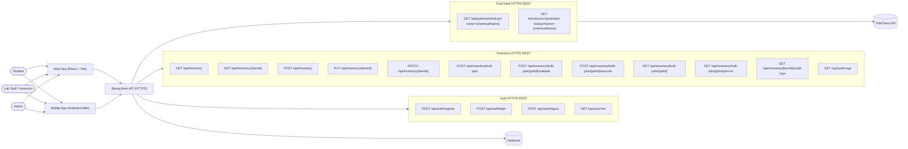

# IT342-Loy-ChemLab

ChemLab is a multi-platform laboratory inventory and request system with a Spring Boot backend, React web frontend, and Android mobile app. The codebase is organized using Vertical Slice Architecture for feature-level modules.

## Project Structure
- backend: Spring Boot API and domain logic
- web: React + Vite frontend
- mobile: Android (Kotlin) client
- docs: Test plan and regression report

## Completed Application Architecture (with HTTPS REST Paths)


## Backend (Spring Boot)
### Environment
Create a backend/.env file with:
- DB_URL
- DB_USERNAME
- DB_PASSWORD
- JWT_SECRET

### Run
```powershell
cd backend
./mvnw.cmd spring-boot:run
```

### Test
```powershell
cd backend
./mvnw.cmd test
```

## Web (React + Vite)
### Install
```powershell
cd web
npm install
```

### Run
```powershell
cd web
npm run dev
```

### Test/Build
```powershell
cd web
npm run test
npm run build
```

## Mobile (Android)
### Test
```powershell
cd mobile
./gradlew.bat test
```

## Documentation
- Test Plan: docs/TEST_PLAN.md
- Regression Report: docs/REGRESSION_REPORT.md
